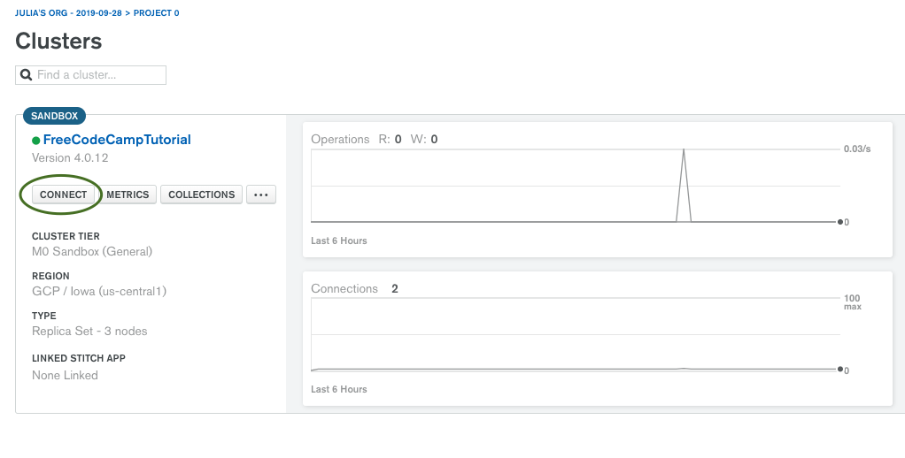
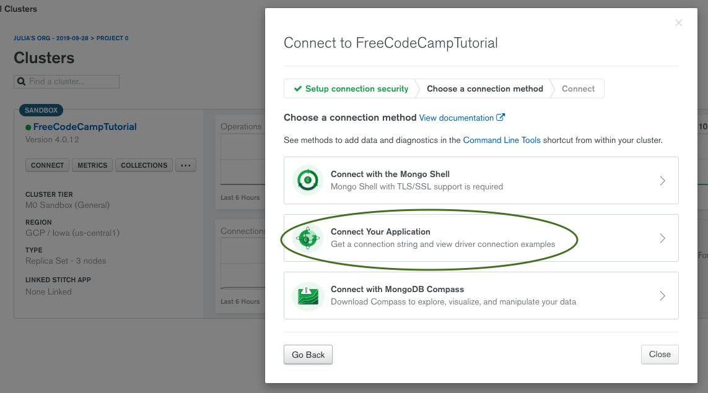

This is the code you get upon completion of the <a target="_blank" href="https://www.youtube.com/watch?v=7CqJlxBYj-M&t=2477s">Learn the MERN Stack - Full Tutorial (MongoDB, Express, React, Node.js)</a> Youtube Tutorial – Completed on September 28, 2019
  
In the tutorial, you create an exercise app where you can create users and create what exercises each user has done. All the data is saved in MongoDB Atlas. You can also edit and delete the exercises.
  
If you download the project, I don't think you will be able to use it because I didn't upload the .env file that contains the secret link allows us to connect to MongoDB Atlas.
  
There were a bunch of things we npm installed which would be good to list now.
 
In the backend folder: `npm install express cors mongoose dotenv`
 
In the frontend folder: `npm install react-router-dom react-datepicker axios`
  
To start the front end, type: `npm start`
To start the back end, type: `nodemon server`

  
In order to get the .env string, you need to be logged into your MongoDB Atlas database. See screenshots below.

